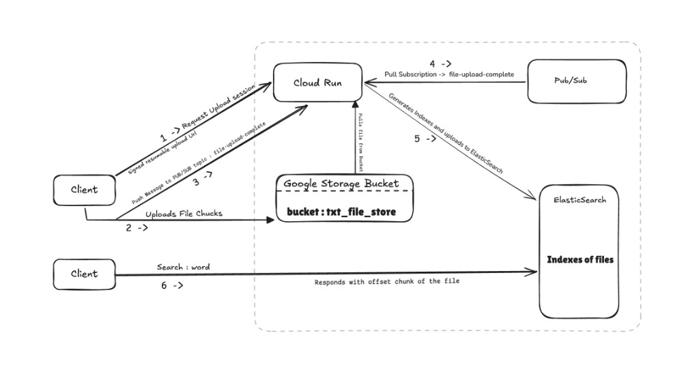
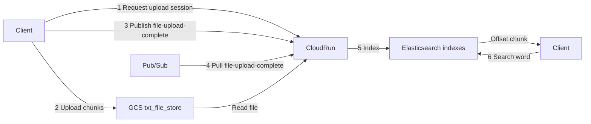

# Large file searching system

Upload large text files to Google Cloud Storage, index their contents in Elasticsearch, and search by word.

## Architecture

1. **Request upload session** — The client asks Cloud Run for a signed resumable upload URL.
2. **Upload file chunks** — The client writes the file directly to the GCS bucket `txt_file_store`.
3. **Publish complete** — The client notifies Cloud Run, which publishes to the Pub/Sub topic `file-upload-complete`.
4. **Pull subscription** — Cloud Run pulls from `file-upload-complete`.
5. **Index** — The worker reads the file from the bucket and writes word indexes to Elasticsearch.
6. **Search** — The client searches by word; Elasticsearch returns matching file chunks with offsets.

