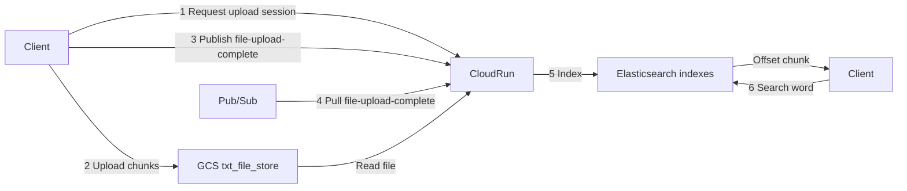

# Large file searching system

Upload large text files to Google Cloud Storage, index their contents in Elasticsearch, and search by word.

## Architecture

1. **Request upload session** — The client asks Cloud Run for a signed resumable upload URL.
2. **Upload file chunks** — The browser splits the file and PUTs each chunk to GCS (`txt_file_store`) on the resumable URL. After each successful chunk it persists the byte offset in `localStorage`.
3. **Publish complete** — The client notifies Cloud Run, which publishes to the Pub/Sub topic `file-upload-complete`.
4. **Pull subscription** — Cloud Run pulls from `file-upload-complete`.
5. **Index** — The worker reads the file from the bucket and writes word indexes to Elasticsearch.
6. **Search** — The client searches by word; Elasticsearch returns matching file chunks with offsets.

## Design notes

Short answers for the usual scale / reliability questions. This is what the current code does, plus what would change at much larger load.

### 1. How you handle a 10 GB file on a 4 GB RAM machine

The API never holds the file. The browser slices the file into **8 MiB chunks** (256 KiB aligned for GCS) and streams each chunk to the resumable URL from step 1. Indexing opens the blob as a text stream, reads line by line, groups **200 lines** into a chunk, and bulk-indexes **50 chunks** at a time, then drops them from memory. RAM is roughly one upload chunk plus one index batch, not the 10 GB file.

### 2. How you handle interrupted uploads

The frontend owns resume. After **each chunk PUT succeeds**, it writes `session_id`, `upload_url`, and `next_offset` to `localStorage`. A refresh or crash does not restart the file: pick the **same file** (name, size, last-modified) and it continues from that offset. It also asks GCS (`Content-Range: bytes */total`) so if the last chunk landed but the tab died before persist, it still skips completed bytes and **retries only the last failed chunk**. Sessions expire after 24 hours. Complete-upload still requires the object to exist; indexing twice is a no-op if already `indexed`.

### 3. How you would support multiple concurrent uploads

i made the API which genrates unique `session_id` and GCS object (`uploads/<session_id>/<filename>`). Clients upload in parallel to different URLs; Cloud Run only issues the URL and later verifies the object. Completions are published to Pub/Sub (`file-upload-complete`) so indexing is not tied to the HTTP request. Today one Cloud Run service also **pulls** that subscription. For more concurrency we can leverage Google Cloud Tasks so many files index at parelley.

### 4. How you would process and index a large file efficiently

Do not download the whole blob to disk on the instance. Stream from GCS → 200-line chunks with `line_start` / `line_end` → Elasticsearch bulk API with stable ids `{session_id}:{chunk_index}`. That keeps memory bounded, makes retries idempotent, and lets search return an offset window instead of a giant document. For even larger files, lower `LINES_PER_CHUNK` / `BULK_BATCH_SIZE`, or split the stream across workers by byte/line ranges.

### 5. How your semantic search works

Chunks are stored in `file_chunks_v2`. `content` is English-analyzed text (`copy_to` `semantic_content`). `semantic_content` is Elasticsearch `semantic_text` (inference embeddings). Search first tries **hybrid RRF**: lexical `match` on `content` (fuzziness `AUTO`) plus `semantic` on `semantic_content`, with optional `session_id` filter and highlights. If the cluster has no semantic mapping, it **falls back** to lexical-only. This is hybrid retrieval, not a custom vector DB.

### 6. What you would change for thousands of concurrent uploads and searches

- **Uploads:** stay client → GCS; Cloud Run only mints URLs. Raise GCS quotas and Cloud Run max instances; do not proxy file bytes through the app.
- **Indexing:** dedicated workers (more Cloud Run min instances, or GKE) pulling Pub/Sub; ack deadline already 600s. Replace in-process `defer` fallback. Move session state off SQLite to Firestore/Postgres.
- **Search:** Elasticsearch as the scale-out layer (replicas, ILM, bigger cluster). Keep the API a thin query frontend. Add rate limits and cache hot queries. 

## Try it

- **Live:** https://dev---largefile-searching-system-pave2cceiq-uc.a.run.app/
- **Local setup:** [setup.md](setup.md)

## API (Postman)

Import these into Postman (**Import** → files):

- [docs/postman/largefile-searching-system.postman_collection.json](docs/postman/largefile-searching-system.postman_collection.json)
- [docs/postman/largefile-searching-system.postman_environment.json](docs/postman/largefile-searching-system.postman_environment.json) (optional; `baseUrl` is also on the collection)

Collection `baseUrl` defaults to the Cloud Run URL. For local, set it to `http://localhost:8091`.

Run in order: **Create upload session** → **PUT file to GCS** → **Complete upload session** → wait a few seconds → **Search**. Create-session writes `session_id` and `upload_url` onto the collection.

| Method | Path | What it does |
| --- | --- | --- |
| `GET` | `/hello` | Health check (`Server is running`) |
| `POST` | `/api/file-handler/create-upload-session` | Returns a GCS resumable `upload_url` |
| `PUT` | `upload_url` (GCS, not this API) | Upload a chunk (`Content-Range: bytes start-end/total`) |
| `POST` | `/api/file-handler/complete-upload-session` | Start indexing |
| `GET` / `POST` | `/api/search` | Search by `query`; optional `session_id` |
